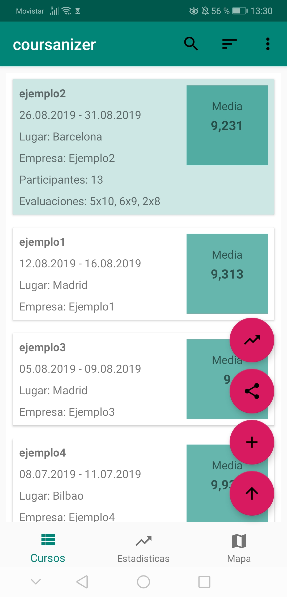
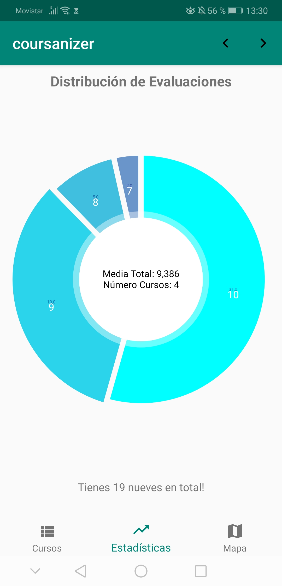
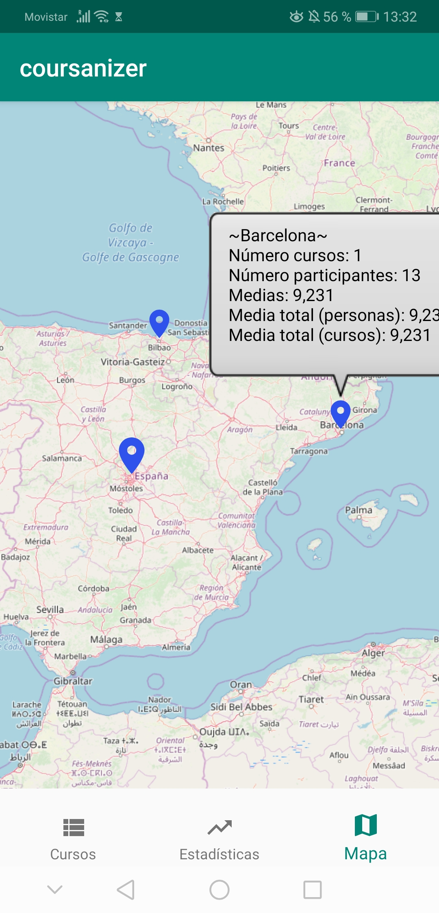

## Description
This is a little Android Application to track given courses. It is used by a small group of persons for a specific usecase. You can insert a course and specify received evaluations. On the main page you have a clean overview of all courses and you can export/import a list of courses. Finally you can see some statistics of the evaluations and a map shows the places where the courses where given with some additional information about it. Currently it is only available in Spanish. 

Under the following link you can download the app: 

https://play.google.com/store/apps/details?id=nicolas.coursanizer47

## Screenshots 

Main screen with overview of all courses and the possibility to add/delete courses, show details and import/export a given list of courses:

Statistics of received evaluations: 

Map of places where courses where given with hoverinfos:

